# Dice Game Package - Final Project for DS5100 - Programming for Data Science

## Overview of Project

### Metadata
Name: Dan Anthony
Project Name: Monte Carlo Simulator

## Synopsis / Demo Code

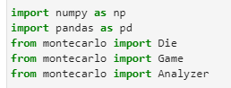

The above imports are needed to run the code below.

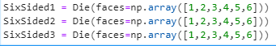

Die Objects are instantiated with a NumPy array showing the faces. Weights are automatically instantiated as an array with values of one. The dataframe with these values is made as well.  

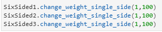

Die objects have a behavior that changes the weight of one side of the die. It takes two input arguments: the face_value and the new_weight.

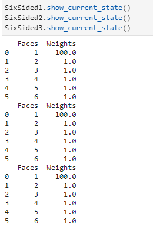

Die objects have a behavior that shows the current state of the face values and their associated weights. This method takes no input.

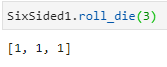

Die objects have a behavior to roll the die and generate a list of values with the sampled roll values based on their weights. This method takes the num_rolls as input. 

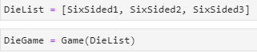

Game objects are instantiated with a list of Die objects.

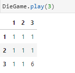

Game objects have a behavior called play that uses the roll_die method to roll all dies in the game the number of times of the input. 

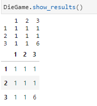

The show results behavior returns the roll values of all of the dies from the most recent play. This method takes no inputs.

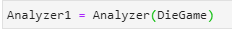

Analyzer objects are insantiated with a Game object.

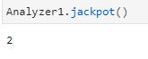

The Analyzer object has a behavior that calculates the number of jackpot conditions from the most recent play of the Game object. A jackpot occurs when all the dice have the same roll value from a specific roll. This method takes no input.

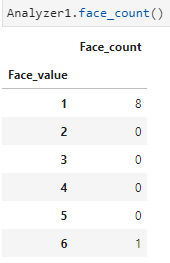

The Analyzer object has a behavior that calculates the number of times each face value has been roll in the most recent game. This method takes no input.

## API Description

List of Classes with Attributes and Methods

1. Die Class: This class represents a Die object. Each Die object has faces and weights that are stored in a DataFrame. The die has three attributes and three methods. The attributes are an array for face values, a list for weights that is converted to an array during initialization, and a dataframe to store the faces and weights. The first method changes the weight of a single side. The second method rolls the die a desired number of times and returns a list with the roll values. The third method shows the current state of the dataframe.

2. Game Class: This class represents the Game object. A game consists of one or more similar dice that are rolled one or more times. Similar dice have the same number of faces, but each die object may have its own weights. Each game is initialized with a list containing one or more Die objects. Games have behaviors to play , roll all dice a given number of times and return a results dataframe, and to returns the results dataframe in a wide or narrow format

3. Analyzer Class: This class represents the Analyzer object. The object takes the results of a single Game object and computes descriptive statistical properties to show results of the single game. The class has a game object and list of dice as attributes and has four methods. The first method is jackpot which computes how many times the game results in the dice having the same roll value for all of the dice it returns an integer with this value. The second method is face_count which returns a dataframe with the counts for each face value across all the dice rolls. The third method, combo_count returns a dataframe with the distinct combinations and their counts (not functional). The fourth method, permutation_count returns a dataframe with distinct permutations (not functional)  
